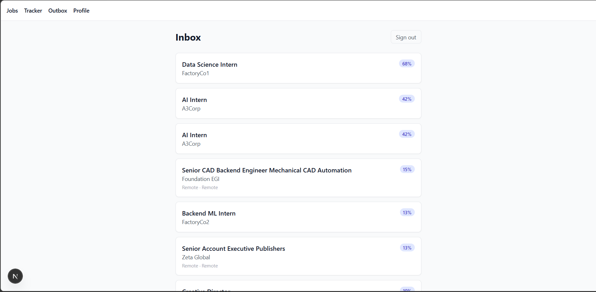
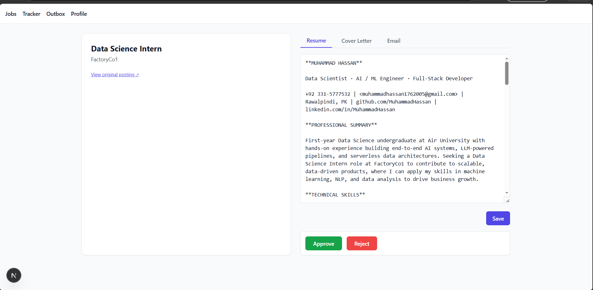
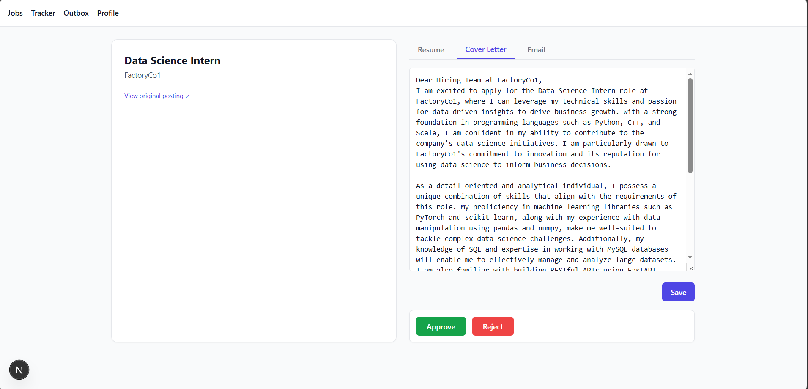
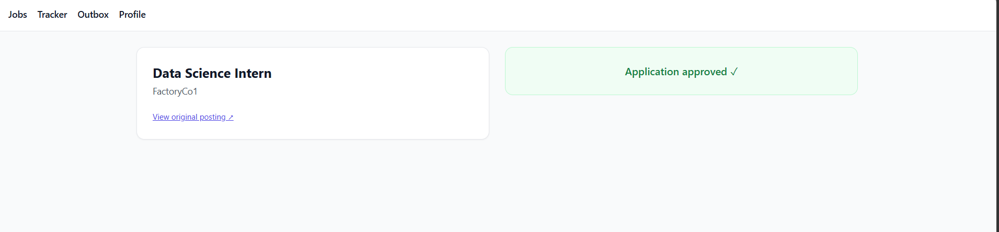
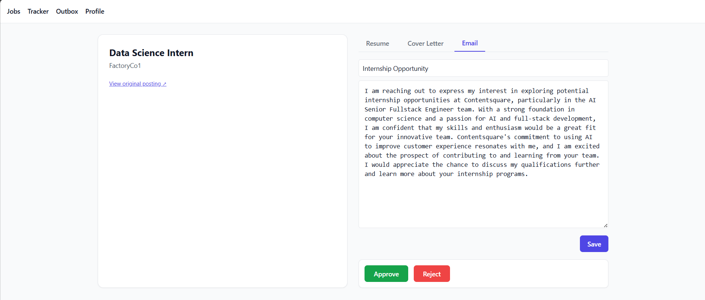
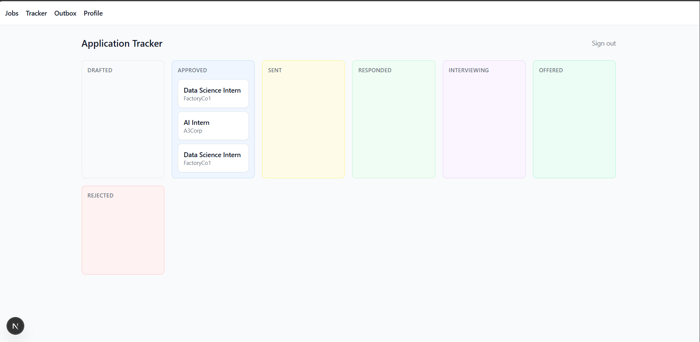

# Internship Intel


*An AI pipeline that finds internships, ranks them, drafts your application, and waits for your approval before anything gets sent.*

I got tired of rewriting the same cover letter twenty different ways for twenty different listings, and I got even more tired of the alternative — automation tools that mass-spam recruiters with templated nonsense. So I built the thing I actually wanted: something that does the grinding work of discovery and drafting, but stops dead and shows me every single message before it goes out. The whole point is human-in-the-loop. The bot finds and writes; I read and decide.

## Demo

<!-- screenshot or short demo gif goes here. I'll add this manually. -->

*More screenshots and a short walkthrough video are coming once I get around to recording one. For now, here's the flow:*

The main inbox where new internship matches land:



Opening a match — the generated resume tailored to the role:



The cover letter draft, side-by-side with the listing so you can edit before approving:



Approval is a single click, but it's a hard gate — nothing leaves until you press it:



What the recipient actually sees in their inbox:



And the kanban tracker for everything in flight:



## What it does

- Discovers internships from RemoteOK, Internshala, and Rozee.pk
- Ranks each one against your profile via a 3-stage funnel (keyword → embedding → LLM judge)
- Generates a tailored resume, cover letter, and cold email for the top matches
- Shows you each draft to edit and approve — nothing sends automatically
- Sends approved applications via Gmail with the tailored resume attached as a PDF
- Tracks every application from drafted → sent → responded → outcome on a kanban board

## Why it's not just another scraper-bot

Quality over quantity is enforced by the system, not by good intentions. The ranker has a daily draft cap and a minimum LLM-judge score below which a listing simply will not produce a draft. If the bar isn't met, you get nothing that day, and that's by design — the failure mode of "send 200 mediocre applications" is exactly what I was trying to avoid.

The ethical constraints are baked into the code. Robots.txt is honored. Rate limits are real and per-source. There is no LinkedIn scraping. There is no form auto-submission anywhere — applications go out as plain Gmail messages, the same way you'd send them yourself, just with the drafting work already done.

Human approval is structural. The database has a `DRAFTED → APPROVED → SENT` state machine, and the sender module literally cannot fire on a row that isn't in `APPROVED` state — there is no override flag, no admin bypass. If you didn't click approve, it didn't go out. That's not a politeness feature, it's a constraint on what the system is capable of doing.

## Tech stack

| Layer | Tools |
| --- | --- |
| Backend | FastAPI, SQLAlchemy 2.0 (async), Alembic, Pydantic v2 |
| Database | Postgres 16 with pgvector (HNSW index for embeddings) |
| LLM | Groq (Llama 3.3 70B) primary, Gemini 2.0 Flash fallback, response caching by prompt hash |
| Embeddings | sentence-transformers `all-MiniLM-L6-v2` (local, batched) |
| Frontend | Next.js 15, Tailwind, shadcn/ui |
| Auth | argon2 password hashing, itsdangerous sessions, Gmail OAuth2 |
| Scheduling | APScheduler |
| Deployment | Docker, Fly.io |

## Architecture

```text
  Scrapers (RemoteOK · Internshala · Rozee.pk)
        |
        v
  Normalizer + Dedup  --(embedding similarity)
        |
        v
  Postgres 16 + pgvector  ---  state machine
        |
        v
  3-Stage Ranker  (keyword -> embedding -> LLM judge)
        |
        v
  Generator  (resume.md + cover_letter.md + cold_email.md)
        |
        v
  Web UI  (Next.js — review, edit, approve)
        |
        v   <-- hard gate: only if APPROVED
  Gmail Sender  (PDF resume attached)
        |
        v
  Tracker  (kanban: drafted -> sent -> responded -> outcome)
```

## Running it locally

1. Clone the repo and step into it.

   ```bash
   git clone https://github.com/MuhammadHassanminhas/automated-job-search.git
   cd automated-job-search
   ```

2. Copy the example env file and fill in the keys. Both `GROQ_API_KEY` and `GEMINI_API_KEY` are free-tier — Groq at [console.groq.com](https://console.groq.com), Gemini at [aistudio.google.com](https://aistudio.google.com/app/apikey). Gmail OAuth credentials come from the Google Cloud console.

   ```bash
   cp .env.example .env
   ```

3. Bring up Postgres.

   ```bash
   docker compose up -d postgres
   ```

4. Install Python dependencies and run migrations.

   ```bash
   uv sync
   uv run alembic upgrade head
   ```

5. Start the backend.

   ```bash
   uv run uvicorn app.main:app --reload
   ```

6. In a second terminal, start the frontend.

   ```bash
   cd web
   pnpm install
   pnpm dev
   ```

The web app will be at `http://localhost:3000`. The API docs are at `http://localhost:8000/docs`.

## Project status

Phase A (the core spine — scrape, rank, draft, approve) and Phase B (expansion — Gmail OAuth, sending, tracking, scheduler, rate limiting, analytics) are both complete. Phase C (deployment to Fly.io with managed secrets and CI) is in progress. The whole thing was built test-first under strict TDD — every feature has a failing test on a `step/<id>/tests` branch before any implementation lands on `step/<id>/impl`. Coverage sits above 80%.

The scrapers occasionally break when one of the source sites changes its HTML — that's the cost of not paying for an aggregator API, and so far I've decided I'd rather fix a selector once a month than pay a subscription. This was originally just a personal project for my own internship search; it's open-sourced because someone else might find it useful, or might want to fork it and point it at jobs other than internships.

## License

MIT. See [LICENSE](LICENSE).


